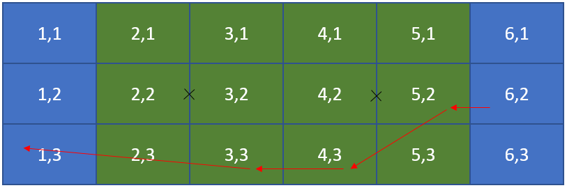

# WUCCStats

## Background
In July 2018 the **World Ultimate Club Championships** were held in Cincinnati Ohio USA. During the championships the commentary team used an online tool written by Tom Styles called www.commentarysource.com. There was a stats person entering the team starting on offense, and every turnover, point, and halftime afterwards. In certain games the location of each pass was also recorded. 

If you are a budding statistian looking for some game data to use in a project then this data is free to use. If you do any analysis on it then I'd love to hear from you. 

## Explaination of the data structure (no pass games)
Each game is an array of scoredPoint objects. The example below shows a point between Grut and Wildcard from the opening game of WUCC. The score is 2-2. There were 2 turnovers in the point, 1 each. Wildcard were on D, Grut were on O. This point is from a game where passes were not being recorded. 

See the point from the game here https://youtu.be/OdO1xL78vKU?t=1034

```
{
    "team1Name": "Grut",
    "team2Name": "Wildcard",
    "turnovers": 2,
    "startedOnOffence": "Wildcard",
    "startedOnDefence": "Grut",
    "scored": "Wildcard",
    "gameStartOnOffence": "Grut",
    "team1Score": 2,
    "team2Score": 2,
    "passes": [],
    "lastPointInHalf": false,
    "scoredBy": 2874,
    "assistBy": null,
    "team1Class": "conceded",
    "team1OorD": "D",
    "team1Turnovers": 1,
    "team2Class": "hold",
    "team2OorD": "O",
    "team2Turnovers": 1,
    "team1Passes": 0,
    "team2Passes": 0
}
```
**Note** In some games such as the above example the game includes no passes - the passes array is empty `"passes": []` and the passes totals for each team are 0.


## Explaination of the data structure (games with passes)
Below is the data from the first point of the game between BFG and Crash at WUCC. (Becky Thompson and Liam Grant on the mics) The first point is 4 passes down the field to a score. 

You can watch the exact point in the game here https://youtu.be/lvku_C3kTDg?t=260

Each pass has a 6 properties

- `startLocation` - where the throw started (see below)
- `endLocation` - where the throw finished (see below)
- `time` - when the pass ended (was caught/dropped). The number of milliseconds since 1970-01-01 00:00 (the epoch as javascript knows it)
- `possession` - the name of the team who has the disc at the start of the pass
- `completed` - boolean whether or not the pass was completed
- `scoringPass` - boolean whether or not the pass was a scoring pass

**Note** a pass that is `"completed": false, "scoringPass": true` is a Callahan.

### Field position
Both `startLocation` and `endLocation` refer to a rough area of the field divided into 18 sections. Across the field the field is split into thirds, and the length of the field is split at the endzones, brick marks, and centre. 



The endzone that is being attacked by each team can be inferred by the location of the scoring pass combined with the team that had possession. 

### Time
In this simple example BFG have the disc and score in 5 quick passes. Time between passes could be used to infer the speed of the game and even if a stoppage had occured. But you need to factor in time disc spent in the air, time before stall count was initiated, and some delay for the statistician to click the button. The timings of the passes in this example are 4.0, 5.1, and 6.1 seconds. Average time per pass should be fairly easy to calculate.


```
{
      "team1Name": "BFG",
      "team2Name": "Crash",
      "turnovers": 0,
      "startedOnOffence": "BFG",
      "startedOnDefence": "Crash",
      "scored": "BFG",
      "gameStartOnOffence": "BFG",
      "passes": [
        {
          "startLocation": [
            6,
            2
          ],
          "endLocation": [
            5,
            2
          ],
          "time": 1532019892271,
          "possession": "BFG",
          "completed": true,
          "scoringPass": false
        },
        {
          "startLocation": [
            5,
            2
          ],
          "endLocation": [
            4,
            3
          ],
          "time": 1532019896296,
          "possession": "BFG",
          "completed": true,
          "scoringPass": false
        },
        {
          "startLocation": [
            4,
            3
          ],
          "endLocation": [
            3,
            3
          ],
          "time": 1532019901419,
          "possession": "BFG",
          "completed": true,
          "scoringPass": false
        },
        {
          "startLocation": [
            3,
            3
          ],
          "endLocation": [
            1,
            3
          ],
          "time": 1532019907556,
          "possession": "BFG",
          "completed": true,
          "scoringPass": true
        }
      ],
      "scoredBy": 2815,
      "assistBy": 2816,
      "team1Class": "hold",
      "team1Passes": 4,
      "team1Turnovers": 0,
      "team1OorD": "O",
      "team1Score": 1,
      "team2Score": 0,
      "team2Class": "conceded",
      "team2OorD": "D",
      "team2Turnovers": 0,
      "team2Passes": 0,
      "lastPointInHalf": false
    }
```


## Games with just points, turns, and halves.

|Game | Video| Data|
|---|---|---|
|Atletico-vs-MUD|[Youtube](https://youtu.be/HBaG-Wt3NeA)|[Atletico-vs-MUD.json](./GamesWithoutPasses/Atletico-vs-MUD.json)|

## Games with points, turns, halves, and passes.

